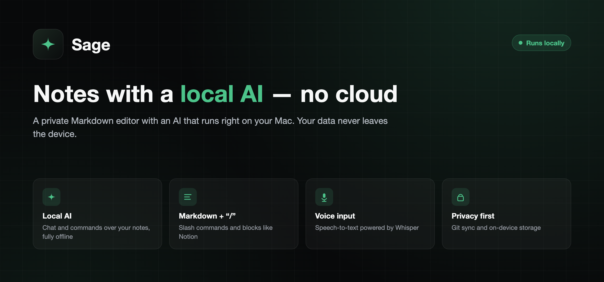
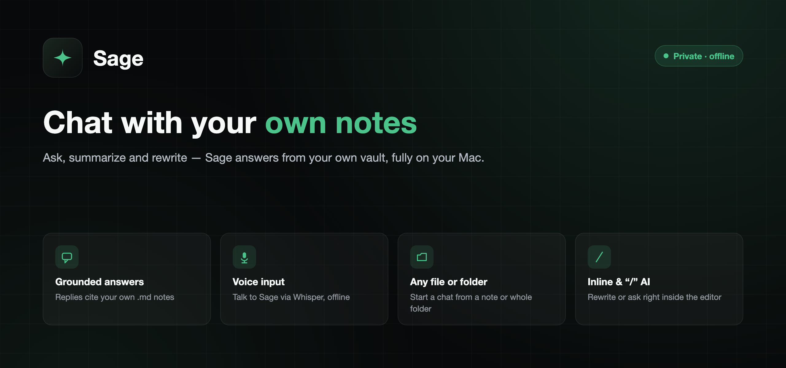
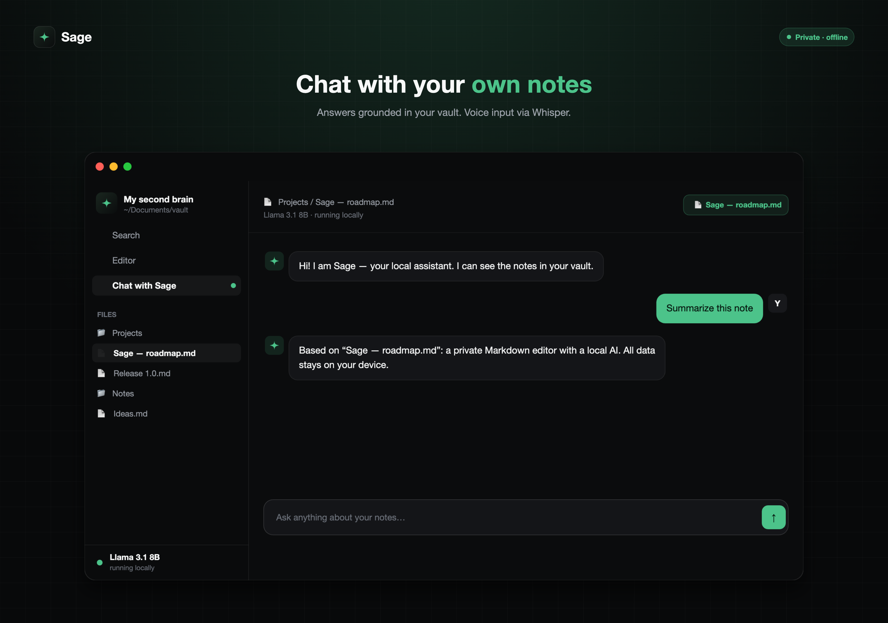
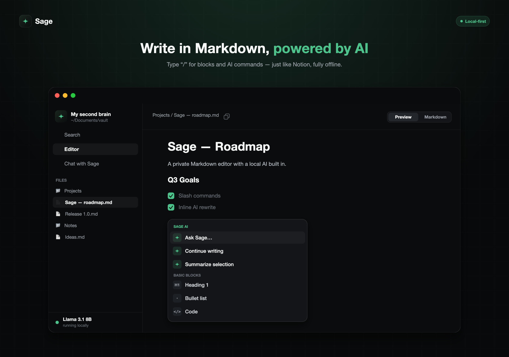

<div align="center">

**English** · [Русский](README.ru.md) · [中文](README.zh.md)




</div>

## What is Sage

**Sage** is a native macOS Markdown notes editor with an AI assistant that runs **entirely on your Mac**. Chat with your own notes, rewrite text inline, dictate by voice — all offline. Nothing is ever sent to the cloud.

Sage works directly on a folder of `.md` files (like Obsidian), so your notes stay plain Markdown that you fully own — readable, portable, and yours forever. The AI model and speech recognition run **on-device**; there is no server, no account, and no telemetry.

<div align="center">

</div>

## Features

### 🤖 Local AI
A large language model (Qwen3 via Apple [MLX](https://github.com/ml-explore/mlx)) runs on your Mac’s Apple-Silicon GPU. Models come in clear tiers — **Light 1.7B**, **Standard 4B**, **Max 8B** — each offered as a classic build and a **DWQ** refresh (distilled quantization: measurably closer to full precision at the same size and speed); **Qwen3 4B Instruct** is the recommended default. Download, switch and **delete** models right in Settings. The model occupies memory only while it is answering: weights load on demand and are released the moment the reply finishes, so idle Sage stays lightweight. Everything downloads once, in-app, then works fully offline.

### ☁️ Optional cloud AI (DeepSeek)
Prefer a bigger brain? Paste your own **DeepSeek API key** in **Settings → AI**, pick a model from your key’s list, and chat and inline AI run through the cloud — with the local model as an automatic fallback on any error. The key is stored in a device-bound encrypted file and never leaves your Mac; remove it any time to go fully local again. The sidebar footer always shows which engine is answering.

### 💬 Chat with your vault
Ask, summarize and rewrite. Answers are **grounded** in your own notes — Sage reads the relevant `.md` files and **cites them** with clickable links, instead of making things up. The context can be:
- a **single note**,
- a **folder**, or
- your **whole vault**.

Sage can also act on your files when you ask: create notes and folders, edit or append content, rename, move and delete — all scoped to the vault.

<div align="center">

</div>

### ✍️ Inline & “/” AI
Inside the editor, select text and ask Sage to **rewrite, simplify, continue, translate or delete** it — the result is applied in place. Or ask a question about the selection and get an answer card. Type **“/”** for a Notion-style menu of blocks and AI actions.

### 📝 Markdown editor
A live-preview editor built on **CodeMirror 6**: headings, **bold/italic**, links, callouts (`> [!note]`), tables, to-do checklists, code blocks with syntax themes, and images. The raw block reveals when your cursor enters it — clean reading, full control on edit.

<div align="center">

</div>

### 🎙️ Voice input
Speech-to-text powered by [Whisper](https://github.com/ggerganov/whisper.cpp) (whisper.cpp), running **locally**. Tap the mic in chat, speak, and your words are transcribed on-device — pick from several Whisper model sizes, or skip voice entirely.

### 🔄 Git sync
Version and sync your notes through **your own** Git repository (GitHub, GitLab or a self-hosted server). Auto-commit and push on a schedule, pull updates from your other machines, with conflict-aware merging. Each vault remembers its own remote and token.

### ⬇️ Over-the-air updates
Sage keeps itself up to date from this repository’s [Releases](../../releases) — checks on launch and daily, downloads in the background, **verifies the SHA-256 checksum**, and applies the update on the next restart. Toggle **auto-update** in **Settings → Updates**. After an update, a one-time **What’s new** window shows the release highlights in your language. See [How auto-update works](#how-auto-update-works).

### 🧰 Quality of life
**Reveal in Finder** from the file context menu · deep links (`sage://open?path=…`) open a note from other apps — Ember’s “Open in Sage” button uses this — with the sidebar expanding down to the file · new notes are created empty · double-space types a period, just like everywhere on macOS.

### 🌍 Three languages
Full interface in **English**, **Русский** and **中文** — switch any time in Settings.

## Requirements

- **macOS 15** (Sequoia) or later
- **Apple Silicon** (M1 or newer)
- ~3–6 GB free disk for the local AI model (downloaded once, in-app)
- Microphone (optional, for voice input)

## Install

1. Download `Sage-x.y.z.zip` from the [latest release](../../releases/latest).
2. Unzip and move **Sage.app** to your `/Applications` folder.
3. **First launch** (one time): Sage is open-source and signed **ad-hoc** (not with a paid Apple Developer ID), so macOS Gatekeeper asks you to confirm it the first time:
   - **Right-click** `Sage.app` → **Open** → **Open** in the dialog, **or**
   - open **System Settings → Privacy & Security**, scroll down and click **Open Anyway**.
   - If macOS says the app is *“damaged and can’t be opened”*, clear the quarantine flag from Terminal:
     ```bash
     xattr -dr com.apple.quarantine /Applications/Sage.app
     ```
   After the first launch, Sage opens normally.
4. On first run, pick your notes folder and download a local AI model — and you’re set, fully offline.

## First run

- **Choose a vault** — any folder containing (or that will contain) `.md` files. Sage reads and writes them directly, like Obsidian.
- **Pick an AI model** — start with the recommended size for your Mac; you can change it later in **Settings → AI Model**.
- **(Optional) Voice model** — choose a Whisper model for dictation, or skip.

## How auto-update works

- Sage polls `https://api.github.com/repos/<owner>/sage/releases` (this repo’s Releases) on launch, when you refocus the app, and once a day. Manual check: **Settings → Updates → Check now**.
- When a newer version is available it **downloads in the background and verifies its SHA-256 checksum** against the release before trusting it.
- The verified update is staged and applied **on the next restart** — Sage shows a *“Update ready · Restart”* toast; nothing is replaced while you’re working, so your session is never interrupted.
- **Auto-update** (download + prepare in the background) is a toggle in **Settings → Updates**.

> Because Sage is ad-hoc signed, the very first time an update replaces the app macOS may ask for a one-time **“App Management”** permission. Allow it once, and future updates are seamless.

## Privacy

Your notes never leave your Mac. The AI model and speech recognition run **locally** on Apple Silicon; there is **no server, no account, and no analytics**. The only network traffic Sage makes is:
- downloading the AI/voice model you choose (once),
- checking GitHub Releases for app updates,
- Git sync — **only** to the repository you configure, if you enable it, and
- cloud AI requests — **only** if you connect your own DeepSeek key (off by default).

Secrets (your Git token and API key) live in a device-bound **encrypted file** on your Mac — they are never synced or uploaded.

## Tech

Native **SwiftUI** · Apple **MLX** (Qwen3 LLM) · **whisper.cpp** speech-to-text · **CodeMirror 6** editor · plain Markdown on disk · multi-module [Tuist](https://tuist.io) project · optional **DeepSeek** cloud (bring your own key) · custom lightweight over-the-air updater (GitHub Releases + SHA-256).

## FAQ

**Where are my notes stored?**
In the folder (vault) you choose — as plain `.md` files on your disk. Sage never moves them into a hidden database.

**Is anything sent to the cloud?**
No. Inference and transcription are on-device. See [Privacy](#privacy) for the only network calls.

**“Sage is damaged and can’t be opened” — what do I do?**
That’s Gatekeeper on an ad-hoc-signed app. Run `xattr -dr com.apple.quarantine /Applications/Sage.app` once, or use right-click → Open. See [Install](#install).

**How do I change the AI model?**
**Settings → AI Model** — download and switch between sizes any time.

**Does it work without an internet connection?**
Yes, fully — once the model is downloaded. Updates and Git sync need a connection, but the editor and AI do not.

**Which Macs are supported?**
Apple Silicon (M1 or newer) on macOS 15+.

## License

© 2026 Sage. All rights reserved.
