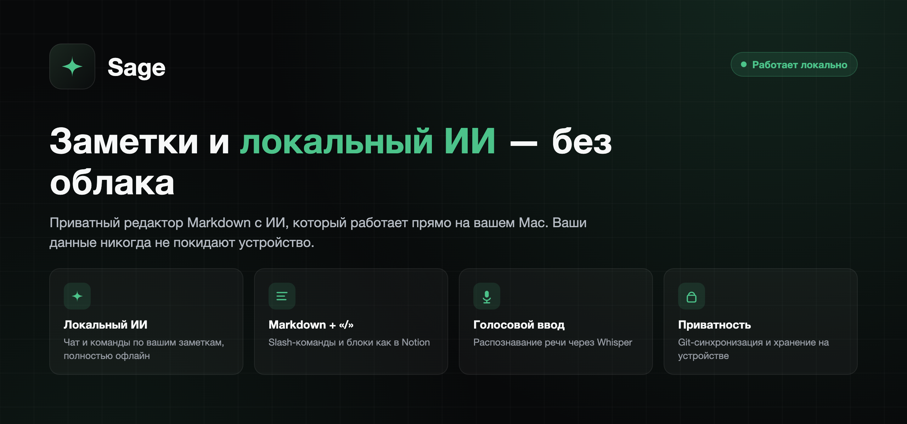
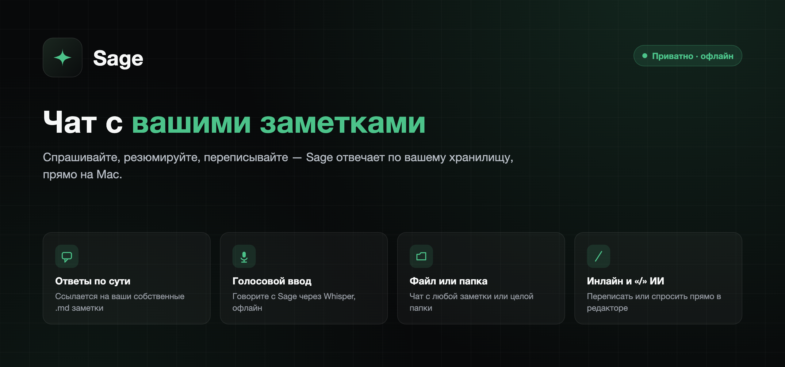
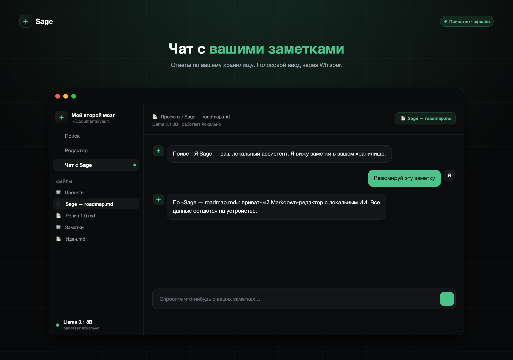
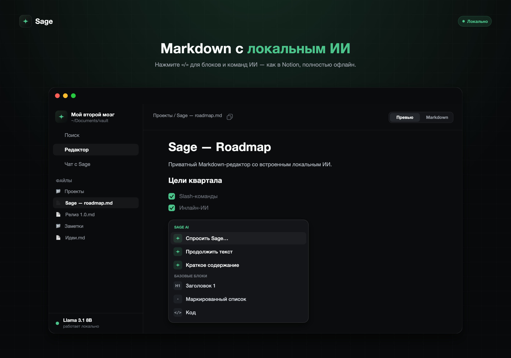

<div align="center">

[English](README.md) · **Русский** · [中文](README.zh.md)




</div>

## Что такое Sage

**Sage** — нативный редактор заметок для macOS на Markdown со встроенным ИИ, который работает **целиком на вашем Mac**. Спрашивайте по своим заметкам, переписывайте текст прямо в редакторе, диктуйте голосом — всё офлайн, ничего не уходит в облако.

Sage работает напрямую с папкой `.md`-файлов, как Obsidian. Заметки остаются обычным Markdown: их легко прочитать, перенести в другое приложение и забрать с собой. Модель ИИ и распознавание речи запускаются **на самом устройстве** — без сервера, без аккаунта, без сбора статистики.

<div align="center">

</div>

## Возможности

### 🤖 Локальный ИИ
Языковая модель (Qwen3 на Apple [MLX](https://github.com/ml-explore/mlx)) считается на GPU вашего Apple Silicon. Размер выбираете под свой Mac: лёгкая **1.7B**, сбалансированная **4B** или самая мощная **8B**. Модель скачивается один раз внутри приложения — дальше всё работает офлайн.

### 💬 Чат с заметками
Спросить, кратко пересказать, переписать. Ответы строятся **на ваших заметках**: Sage читает нужные `.md`-файлы и **даёт на них ссылки**, а не выдумывает. Контекст задаётся одним из трёх способов:
- **одна заметка**,
- **папка**,
- **всё хранилище**.

По просьбе Sage и сам меняет файлы: создаёт заметки и папки, правит и дополняет текст, переименовывает, перемещает, удаляет — но только внутри вашего хранилища.

<div align="center">

</div>

### ✍️ ИИ в редакторе и меню «/»
Выделите текст и попросите Sage **переписать, упростить, продолжить, перевести или удалить** — правка применится на месте. Можно и просто задать вопрос о выделенном фрагменте — ответ покажется карточкой. Наберите **«/»**, чтобы открыть меню блоков и ИИ-команд в стиле Notion.

### 📝 Редактор Markdown
Живой предпросмотр на **CodeMirror 6**: заголовки, **жирный** и *курсив*, ссылки, выноски (`> [!note]`), таблицы, списки задач, блоки кода с подсветкой и картинки. Когда курсор входит в блок, тот показывает исходный Markdown — читать удобно, а править можно всё.

<div align="center">

</div>

### 🎙️ Голосовой ввод
Распознавание речи на [Whisper](https://github.com/ggerganov/whisper.cpp) — **локально**. Нажмите микрофон в чате и говорите, текст распознаётся прямо на устройстве. Модель Whisper выбираете сами или отключаете голос совсем.

### 🔄 Синхронизация через Git
Храните историю заметок и синхронизируйте их через **свой** Git-репозиторий — GitHub, GitLab или собственный сервер. Sage сам делает коммиты и отправляет их по расписанию, подтягивает изменения с других устройств и аккуратно сливает правки при конфликтах. У каждого хранилища — свой репозиторий и свой токен доступа.

### ⬇️ Обновления по воздуху
Sage обновляется сам из раздела [Releases](../../releases): проверяет новую версию при запуске и раз в сутки, качает её в фоне, **сверяет контрольную сумму SHA-256** и устанавливает при следующем перезапуске. Автообновление включается в **Настройках → Обновления**. Подробнее — [как это работает](#как-работает-автообновление).

### 🌍 Три языка
Интерфейс полностью переведён на **русский**, **English** и **中文** — язык меняется в настройках в любой момент.

## Требования

- **macOS 15** (Sequoia) или новее
- **Apple Silicon** (M1 или новее)
- 3–6 ГБ свободного места под локальную модель (скачивается один раз)
- Микрофон — по желанию, для голосового ввода

## Установка

1. Скачайте `Sage-x.y.z.zip` из [последнего релиза](../../releases/latest).
2. Распакуйте и перенесите **Sage.app** в папку `/Applications`.
3. **Первый запуск** (один раз). Sage — открытый проект с ad-hoc-подписью (без платного Apple Developer ID), поэтому при первом запуске macOS попросит подтверждение. Проще всего выполнить в **Терминале**:
   ```bash
   xattr -dr com.apple.quarantine /Applications/Sage.app
   ```
   После этого приложение открывается как обычно. *(Либо: правый клик по `Sage.app` → «Открыть», или Системные настройки → «Конфиденциальность и безопасность» → «Всё равно открыть».)*
4. При первом запуске выберите папку с заметками и скачайте модель — дальше всё работает офлайн.

## Первый запуск

- **Папка с заметками** — любая папка с `.md`-файлами (или пустая, под будущие). Sage читает и пишет файлы напрямую, как Obsidian.
- **Модель ИИ** — начните с размера, который Sage порекомендует для вашего Mac; сменить можно в **Настройках → ИИ-модель**.
- **Модель голоса** (по желанию) — выберите Whisper для диктовки или пропустите этот шаг.

## Как работает автообновление

- Sage обращается к разделу Releases этого репозитория при запуске, при возвращении в приложение и раз в сутки. Вручную — **Настройки → Обновления → Проверить сейчас**.
- Найдя новую версию, Sage **скачивает её в фоне и сверяет SHA-256** с релизом, прежде чем чему-либо доверять.
- Проверенное обновление готовится заранее и устанавливается **при следующем перезапуске** — появится уведомление «Обновление готово · Перезапустить». Пока вы работаете, ничего не подменяется и сессия не прерывается.

> Из-за ad-hoc-подписи при самой первой замене приложения macOS может один раз спросить разрешение «Управление приложениями». Разрешите — дальше обновления идут незаметно.

## Приватность

Заметки не покидают ваш Mac. Модель и распознавание речи работают **локально** на Apple Silicon — без сервера, аккаунта и аналитики. В сеть Sage выходит только чтобы:
- один раз скачать выбранную модель (ИИ или голос),
- проверить обновления в GitHub Releases,
- синхронизироваться по Git — и **только** с тем репозиторием, который вы сами указали.

## Технологии

Нативный **SwiftUI** · Apple **MLX** (модель Qwen3) · **whisper.cpp** для речи · редактор **CodeMirror 6** · обычный Markdown на диске · многомодульный проект на [Tuist](https://tuist.io) · собственный лёгкий апдейтер (GitHub Releases + SHA-256).

## Вопросы и ответы

**Где лежат мои заметки?**
В выбранной папке — обычными `.md`-файлами. Sage не прячет их в скрытую базу.

**Что-нибудь уходит в облако?**
Нет. Модель и распознавание считаются на устройстве. Полный список сетевых обращений — в разделе [Приватность](#приватность).

**macOS пишет «Sage повреждён и не может быть открыт».**
Так Gatekeeper реагирует на ad-hoc-подпись. Выполните один раз `xattr -dr com.apple.quarantine /Applications/Sage.app` или откройте через правый клик → «Открыть». См. [Установку](#установка).

**Как сменить модель ИИ?**
В **Настройках → ИИ-модель** — там же можно скачивать и переключать размеры.

**Работает ли без интернета?**
Да, полностью — после того как модель скачана. Интернет нужен только для обновлений и Git-синхронизации; редактору и ИИ — нет.

**Какие Mac поддерживаются?**
Apple Silicon (M1 и новее) на macOS 15+.

## Лицензия

© 2026 Sage. Все права защищены.
