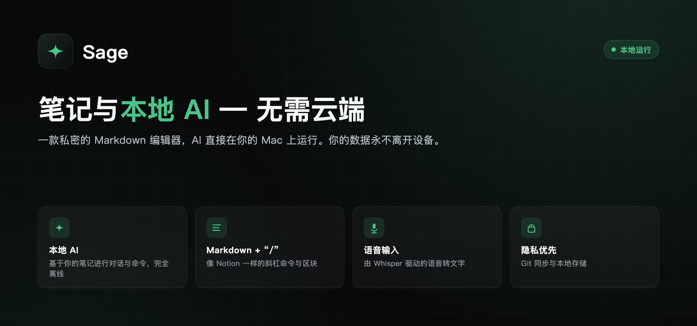
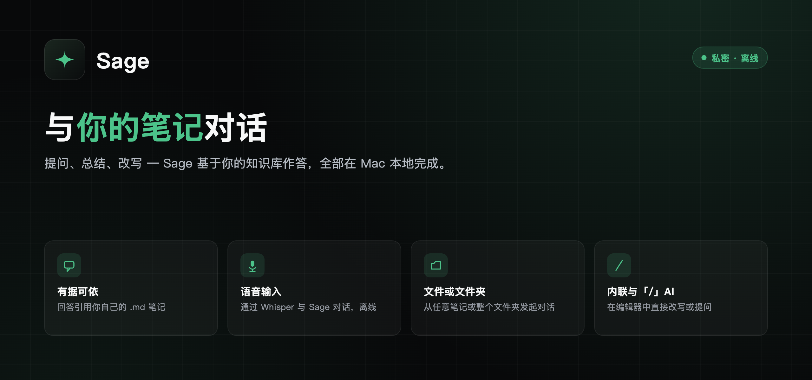
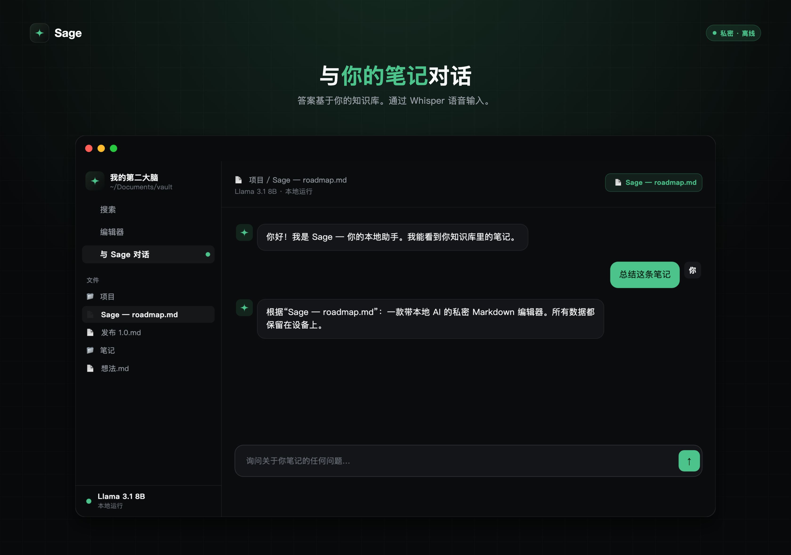
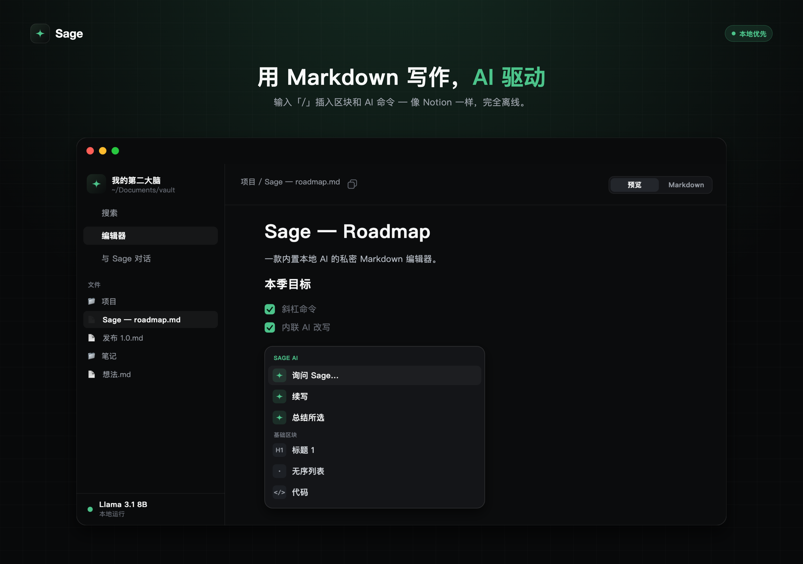

<div align="center">

[English](README.md) · [Русский](README.ru.md) · **中文**




</div>

## 什么是 Sage

**Sage** 是一款原生 macOS Markdown 笔记编辑器，内置**完全运行在你 Mac 上**的 AI 助手。就你的笔记提问、在编辑器里直接改写文字、用语音口述 —— 全部离线完成，任何内容都不会上传到云端。

Sage 直接作用于一个 `.md` 文件夹（类似 Obsidian），因此你的笔记始终是你完全拥有的纯 Markdown —— 可读、可迁移、永远属于你。AI 模型与语音识别都在**本机**运行：没有服务器、没有账户、没有遥测。

<div align="center">

</div>

## 功能

### 🤖 本地 AI
大语言模型（通过 Apple [MLX](https://github.com/ml-explore/mlx) 运行的 Qwen3）在 Apple Silicon GPU 上运行。模型按清晰的级别分组 —— **轻量 1.7B**、**标准 4B**、**旗舰 8B** —— 每档都提供经典版与 **DWQ** 版（蒸馏量化：同等体积与速度下明显更接近全精度）；推荐使用 **Qwen3 4B Instruct**。在设置中即可下载、切换与**删除**模型。模型仅在回答时占用内存：权重按需加载，回答结束立即释放 —— 空闲时 Sage 依然轻盈。一切都在应用内下载一次，之后完全离线工作。

### ☁️ 可选云端 AI（DeepSeek）
需要更强的大脑？在 **设置 → AI 模型** 中粘贴你自己的 **DeepSeek API 密钥**，从该密钥可用的列表中选择模型 —— 聊天与行内 AI 即走云端，任何错误时本地模型自动兜底。密钥保存在与本机绑定的加密文件中，绝不外传；随时删除即可回到完全本地。侧栏底部的状态始终显示当前由哪个引擎回答。

### 💬 与笔记库对话
提问、总结、改写。回答**基于**你自己的笔记 —— Sage 会读取相关 `.md` 文件并以可点击链接**引用**它们，而不是凭空捏造。上下文可以是：
- 单个**笔记**，
- 一个**文件夹**，或
- 整个**笔记库**。

Sage 还能按你的要求操作文件：创建笔记和文件夹、编辑或追加内容、重命名、移动和删除 —— 全部限定在笔记库内。

<div align="center">

</div>

### ✍️ 行内与「/」AI
在编辑器中选中文字，让 Sage **改写、简化、续写、翻译或删除**它 —— 结果就地应用。也可以就选中内容提问，得到回答卡片。输入 **「/」** 即可调出类 Notion 的区块与 AI 操作菜单。

### 📝 Markdown 编辑器
基于 **CodeMirror 6** 的实时预览编辑器：标题、**粗体/斜体**、链接、提示框（`> [!note]`）、表格、待办清单、带语法主题的代码块以及图片。光标进入某个区块时显示其原始内容 —— 阅读清爽，编辑时完全可控。

<div align="center">

</div>

### 🎙️ 语音输入
由 [Whisper](https://github.com/ggerganov/whisper.cpp)（whisper.cpp）提供的语音转文字，**本地**运行。在聊天中点击麦克风并说话，文字即在本机转写；可选择不同大小的 Whisper 模型，或完全跳过语音。

### 🔄 Git 同步
通过**你自己的** Git 仓库（GitHub、GitLab 或自建服务器）对笔记进行版本管理与同步。按计划自动提交并推送，从你的其他设备拉取更新，并具备冲突感知的合并。每个笔记库记住各自的远程地址与令牌。

### ⬇️ 空中更新
Sage 会从本仓库的 [Releases](../../releases) 自动保持更新 —— 启动时与每天检查，后台下载，**校验 SHA-256 校验和**，并在下次重启时应用更新。在 **设置 → 更新** 中可切换**自动更新**。更新完成后，Sage 会以界面语言一次性展示「新变化」窗口。参见 [空中更新如何工作](#空中更新如何工作)。

### 🧰 贴心细节
文件右键菜单中的**在访达中显示** · 深链接（`sage://open?path=…`）可从其他应用打开笔记 —— Ember 的「在 Sage 中打开」按钮正是如此 —— 侧栏会自动展开到该文件 · 新笔记默认为空 · 连按两次空格输入句号，与 macOS 一致。

### 🌍 三种语言
完整界面支持 **English**、**Русский** 与 **中文** —— 随时在设置中切换。

## 系统要求

- **macOS 15**（Sequoia）或更高版本
- **Apple Silicon**（M1 或更新）
- 约 3–6 GB 可用磁盘空间用于本地 AI 模型（应用内下载一次）
- 麦克风（可选，用于语音输入）

## 安装

1. 从[最新发布](../../releases/latest)下载 `Sage-x.y.z.zip`。
2. 解压并将 **Sage.app** 移动到 `/Applications` 文件夹。
3. **首次启动**（仅一次）：Sage 是开源的，采用 **ad-hoc** 签名（未使用付费的 Apple Developer ID），因此 macOS Gatekeeper 首次会要求确认：
   - **右键点击** `Sage.app` → **打开** → 在对话框中再点 **打开**，**或**
   - 打开 **系统设置 → 隐私与安全性**，向下滚动并点击 **仍要打开**。
   - 若 macOS 提示应用 *“已损坏，无法打开”*，在终端清除隔离标记：
     ```bash
     xattr -dr com.apple.quarantine /Applications/Sage.app
     ```
   首次启动后，Sage 即可正常打开。
4. 首次运行时选择你的笔记文件夹并下载一个本地 AI 模型 —— 即可完全离线使用。

## 首次运行

- **选择笔记库** —— 任意含有（或将含有）`.md` 文件的文件夹。Sage 像 Obsidian 一样直接读写它们。
- **选择 AI 模型** —— 从适合你 Mac 的推荐大小开始；之后可在 **设置 → AI 模型** 更换。
- **（可选）语音模型** —— 选择一个用于口述的 Whisper 模型，或跳过。

## 空中更新如何工作

- Sage 在启动时、应用重新获得焦点时以及每天，轮询 `https://api.github.com/repos/<owner>/sage/releases`（本仓库的 Releases）。手动检查：**设置 → 更新 → 立即检查**。
- 当有更新的版本时，**在后台下载并校验 SHA-256**，确认无误后才信任该文件。
- 经校验的更新会被暂存并在**下次重启时应用** —— Sage 会显示 *“更新已就绪 · 重新启动”* 提示；运行期间不会替换任何文件，你的工作不会被打断。
- **自动更新**（后台下载并准备）是 **设置 → 更新** 中的开关。

> 由于 Sage 为 ad-hoc 签名，更新首次替换应用时，macOS 可能会请求一次 **「App 管理」** 权限。允许一次后，后续更新即可无缝完成。

## 隐私

你的笔记永远不会离开你的 Mac。AI 模型与语音识别都在 Apple Silicon 上**本地**运行：**没有服务器、没有账户、没有分析统计**。Sage 仅有的网络流量是：
- 下载你选择的 AI／语音模型（一次），
- 检查 GitHub Releases 中的应用更新，
- Git 同步 —— 仅当你启用时，**只**与你配置的仓库通信，以及
- 云端 AI 请求 —— **仅当**你自行接入 DeepSeek 密钥时（默认关闭）。

机密信息（Git 令牌、API 密钥）保存在与本机绑定的**加密文件**中 —— 不会同步，也不会上传。

## 技术

原生 **SwiftUI** · Apple **MLX**（Qwen3 大模型）· **whisper.cpp** 语音转文字 · **CodeMirror 6** 编辑器 · 磁盘上的纯 Markdown · 多模块 [Tuist](https://tuist.io) 工程 · 可选 **DeepSeek** 云端（自备密钥）· 自研轻量空中更新器（GitHub Releases + SHA-256）。

## 常见问题

**我的笔记存在哪里？**
存在你选择的文件夹（笔记库）中 —— 即磁盘上的纯 `.md` 文件。Sage 绝不会把它们藏进隐藏数据库。

**有任何内容上传到云端吗？**
没有。推理与转写都在本机进行。仅有的网络调用见 [隐私](#隐私)。

**提示「Sage 已损坏，无法打开」怎么办？**
这是 Gatekeeper 对 ad-hoc 签名应用的提示。执行一次 `xattr -dr com.apple.quarantine /Applications/Sage.app`，或使用右键 → 打开。参见 [安装](#安装)。

**如何更换 AI 模型？**
**设置 → AI 模型** —— 随时下载并在不同大小之间切换。

**没有网络能用吗？**
可以，完全可用 —— 只要模型已下载。更新与 Git 同步需要联网，但编辑器与 AI 不需要。

**支持哪些 Mac？**
macOS 15+ 上的 Apple Silicon（M1 或更新）。

## 许可证

© 2026 Sage. 保留所有权利。
